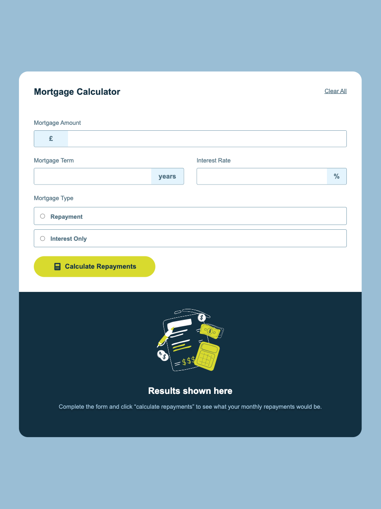

# Frontend Mentor - Mortgage repayment calculator solution

This is a solution to the [Mortgage repayment calculator challenge on Frontend Mentor](https://www.frontendmentor.io/challenges/mortgage-repayment-calculator-Galx1LXK73). Frontend Mentor challenges help you improve your coding skills by building realistic projects.

## Table of contents

- [Overview](#overview)
  - [The challenge](#the-challenge)
  - [Screenshot](#screenshot)
  - [Links](#links)
- [My process](#my-process)
  - [Built with](#built-with)
  - [What I learned](#what-i-learned)
  - [Continued development](#continued-development)
  - [Useful resources](#useful-resources)
- [Author](#author)

## Overview

### The challenge

Users should be able to:

- Input mortgage information and see monthly repayment and total repayment amounts after submitting the form
- See form validation messages if any field is incomplete
- Complete the form only using their keyboard
- View the optimal layout for the interface depending on their device's screen size
- See hover and focus states for all interactive elements on the page

### Screenshot

### Links

- Solution URL: [GitHub](https://github.com/raulgaliciab/mortgage-repayment-calculator)
- Live Site URL: [Vercel](https://mortgage-repayment-calculator-dun.vercel.app/)

## My process

### Built with

- Semantic HTML5 markup
- Flexbox
- CSS pseudo classes
- Mobile-first workflow
- Media queries
- Vanilla JavaScript
- ES Modules
- DOM Manipulation

### What I learned

This exercise was a great way to practice all I've been learning in the past months and learn new things in the process.

These are the new things that I learned:

HTML & CSS:

- **Pseudo class :focus**: In order to work you have to use it in focusable elements such as input, textarea, button or a.
- **fieldset:** You can use it inside a form to group labels and inputs.
- It's easier to style, and add aditional elements, to a **button** tag than an **input[type:submit]** tag.

JavaScript:

- **FormData:** You can use it to get the information from a form when you submit it.
- You can use **DOM manipulation** to hide and unhide elements changing their display.

### Continued development

- Have different git branches for different elements of the project
- Create a more detailed requirement list before coding
- Optimize the CSS code
- Separate the JS code into modules since the beginning

### Useful resources

- [FormData](https://developer.mozilla.org/en-US/docs/Web/API/FormData) - This helped me to find an easy way to get the information from a form to use it in JS.

- [Number.prototype.toLocaleString()](https://developer.mozilla.org/es/docs/Web/JavaScript/Reference/Global_Objects/Number/toLocaleString) - This helped me to convert the result to a comma format

## Author

### Raúl Galicia

- Frontend Mentor - [@raulgaliciab](https://www.frontendmentor.io/profile/raulgaliciab)
